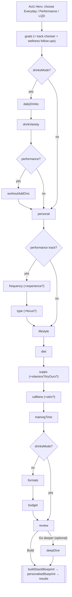

# CHRGD Quiz — Phase 1 Forensic Audit

**Status:** Phase 1 of 3 (read-only). No code changed. Stop-and-review before Phase 2.
**Scope:** the acquisition quiz (`Act2Quiz`), its recommendation engine (`stack-blueprint`, `lqd`, `pour-plan`), the catalogue model, and pricing/cadence. Every claim below cites `file:line`.

## 0. Assumptions & ground rules used for this audit

1. **Catalogue reality.** Per your answer, real products will be **auto-mapped from the PowerBody Wholesale API**; the mock catalogue (`src/lib/catalogue/mock-catalogue.ts`) is the current source of truth in dev/CI (`mock-catalogue.ts:1-14`). I therefore treat the mock as *structurally* representative of the engine's behaviour, and I have run the **actual engine** against it to produce the persona bundles in §4. **Every specific dose/efficacy judgement in §4 must be re-verified against real PowerBody SKUs** — see the PowerBody mapping risk in §3, which is the single biggest catalogue-quality issue.
2. **Four paths confirmed.** `track ∈ {wellbeing, performance}` × `drinksMode ∈ {off (supps), on (LQD drinks)}` = the four paths (General Wellbeing, Health & Performance, Drinks–Wellbeing, Drinks–Performance). Note the engine itself does **not** branch on `track`; it branches on whether any *goal* is a performance goal (`factory.ts:119-129, 548`). `track` is a UX routing device only.
3. **Persona bundles in §4 are real engine output**, produced by running `buildStackBlueprint` + `calculatePricing` + `buildLqdPlan` over the mock catalogue (harness since removed; Phase 1 is read-only).

---

## 1. Flow map

### 1.1 Step model

The flow is one ordered, id-based sequence (`QUIZ_STEPS`, `quiz-flow.ts:73-98`) filtered per path by `activeSteps(track, drinksMode)` (`quiz-flow.ts:102-110`):

- `tracks?: ['performance']` → performance-only steps (`frequency`, `type`, `workoutAddOns`).
- `skipInDrinksMode` → dropped in LQD (`formats`, `budget`).
- `onlyInDrinksMode` → LQD-only (`dailyDrinks`, `drinkVariety`, `workoutAddOns`).

The advertised count is `seq.length − 2` — `review` and `deepDive` are excluded from the counter (`Act2Quiz.tsx:1066, 1106`). `deepDive` is an optional bonus reached only from the review screen (`Act2Quiz.tsx:788-795, 1665-1680`).

**Two steps are compound (they hide multiple questions):**
- `goals` renders: track chooser → goal grid(s) → **up to 3 inline "wellness follow-ups"** (`sleepQuality`, `stressPattern`, `immuneBaseline`, `collagenOk`) that appear beneath the grid whenever wellness goals are chosen (`Act2Quiz.tsx:1118-1236`, bank at `125-175`, selector `pickWellbeingQuestions` `177-195`).
- Several single-choice steps spawn **inline sub-questions**: `frequency`→experience (if 5-6×/daily), `type`→strength-focus/sport-type (if exactly one style), `caffeine`→stim-preference (if high) (`Act2Quiz.tsx:41-79, 916-918`).

### 1.2 Sequence per path

| # | Performance supps | Wellbeing supps | Drinks–Performance | Drinks–Wellbeing |
|---|---|---|---|---|
| 1 | goals (+wellness f/ups) | goals (+wellness f/ups) | goals (+wellness f/ups) | goals (+wellness f/ups) |
| 2 | personal | personal | dailyDrinks | dailyDrinks |
| 3 | frequency (+experience?) | lifestyle | drinkVariety | drinkVariety |
| 4 | type (+focus?) | diet | workoutAddOns | personal |
| 5 | lifestyle | supps (+tryOurs?) | personal | lifestyle |
| 6 | diet | caffeine | frequency (+experience?) | diet |
| 7 | supps (+vitamins?/tryOurs?) | trainingTime | type (+focus?) | supps (+tryOurs?) |
| 8 | caffeine (+stim?) | formats | lifestyle | caffeine |
| 9 | trainingTime | budget | diet | trainingTime |
| 10 | formats | **review** → results | supps (+tryOurs?) | **review** → results |
| 11 | budget | *(deepDive optional)* | caffeine (+stim?) | *(deepDive optional)* |
| 12 | **review** → results | | trainingTime | |
| 13 | *(deepDive optional)* | | **review** → results | |
| 14 | | | *(deepDive optional)* | |
| **Advertised count** | **11** | **9** | **12** | **9** |
| **Realistic tap count** | ~13–16 | ~10–12 | ~13–17 | ~10–12 |

### 1.3 Per-step attributes

| Step | Type | Required? | Auto-advance | Consumed by engine? | Branch/notes |
|---|---|---|---|---|---|
| `goals` | multi | Yes (≥1) | manual | **Heavy** | Track chooser + inline wellness f/ups. `canContinue` needs track + ≥1 goal (`Act2Quiz.tsx:888`) |
| `dailyDrinks` | single | No (defaults 2) | auto | Size only | Mirrors into `drinksPerDay` (`Act2Quiz.tsx:1250`) |
| `drinkVariety` | single | No | auto | **Almost none** | See §2 — inert except `reconcile && staples` |
| `workoutAddOns` | optional | No | manual | **Almost none** | See §2 — only `pre-workout` de-selection matters |
| `personal` | form | **Age only** | manual | ageBracket/gender (light) | name+gender+exactAge optional; exactAge → bracket only |
| `frequency` | single | No | auto | Cadence + light scoring | →experience sub-q if 5-6×/daily |
| `type` | multi | Yes (≥1) | manual | **Only via focus** | trainingType never reaches `scoreProduct` (see §2) |
| `lifestyle` | optional | No | manual | Medium (soft boosts + vegan gate) | Track-specific option set |
| `diet` | single | No | auto | Medium | clean/poor/inconsistent scoring |
| `supps` | optional | No | manual | **Heavy (exclusions)** | +vitamins sub-grid, +tryOurs toggle |
| `caffeine` | single | No | auto | Medium (stim gating) | →stim sub-q if high |
| `trainingTime` | single | No | auto | Low (evening+stim only) | Asked of everyone incl. non-trainers |
| `formats` | multi | No | manual | Medium (−18 penalty) | Skipped in drinks mode |
| `budget` | single | Yes | manual | **Heavy (cap + size)** | Skipped in drinks mode; swipe deck |
| `review` | form | — | manual | — | Edit-jumps; builds stack |
| `deepDive` | form | No | manual | Low (6 whitelisted signals) | AI-written, optional |

### 1.4 Mermaid

---

## 2. Signal-to-recommendation trace

For each answer: where it is consumed, and whether it changes the **output bundle** (product selection) in at least one realistic scenario. **Friction candidates** (no bundle effect, or effect unreachable in practice) are flagged 🚩.

| Answer | Consumed at | Changes the bundle? | Verdict |
|---|---|---|---|
| `track` | routes flow only; engine uses `hasPerformanceGoals(goals)` `factory.ts:548` | Indirectly (which Qs shown) | Keep (routing) |
| `goals` | archetype `factory.ts:123`; required/ordered slots `96-117`; overlap+affinity scoring `160,262-297`; hard gates `171-183` | **Yes, dominant** | **Keep — primary signal** |
| `primaryGoal` | **never set by the UI** — `setGoals` writes only `goals` (`store.tsx:142`). Engine uses `goals[0]` (`factory.ts:518`); pour-plan falls back to `goals[0]` (`pour-plan/index.ts:165`) | No (always = first-tapped goal) | 🚩 **Declared, unwired.** "The goal that matters most" (`types.ts:118-123`) is silently the first goal tapped. Real gap. |
| `dailyDrinks`/`drinksPerDay` | `maxSlots` in drinks mode `factory.ts:528-532`; pace-scaling `pricing.ts:376-394,647-663`; LQD fit copy `lqd.ts:202-215` | Yes (box **size**, not which products) | Keep |
| `drinkVariety` | only `pour-plan/index.ts:164,191-203` — trims kinds **only** when `reconcile && staples`; `variety` = no-op | Rarely | 🚩 **Near-inert.** Two-option question that usually changes nothing. |
| `workoutAddOns` | `buildLqdPlan` filter `lqd.ts:156-183`. Only `energy`→`pre-workout` maps; `protein`/`recovery` return `null` → always kept | Only `pre-workout` **de-select** drops a line | 🚩 **Mostly inert.** Picking "protein"/"recovery" does nothing; it can't *add* a product the goals didn't already yield. |
| `name` | reason greeting `factory.ts:411`; AI identity | No | Keep (personalisation copy) |
| `ageBracket` | 45+ / 35-44 boosts `factory.ts:346-354` | Yes (vit-D/collagen/omega tiebreak) | Keep |
| `exactAge` | **AI prompts only** (`ai-questions.ts:95`, `ai-stack.ts:79`); deterministic engine reads `ageBracket` | No (engine) | 🚩 Slider is redundant precision for selection. |
| `gender` | `female`→multivitamin +8 `factory.ts:343-345` | Marginally (female only) | 🚩 Weak: male/nonbinary/unspecified change nothing. |
| `trainingFrequency` | `workoutsPerMonth` cadence `pricing.ts:324-332`; name `factory.ts:132`; new-athlete penalty `392`; reason suffixes | Yes (cadence + light scoring) | Keep |
| `trainingType` | **never read by `scoreProduct`** — only `userProfileSummary` display `factory.ts:801` + AI prompts | Only via the `trainingFocus` sub-q, which needs **exactly one** style (`Act2Quiz.tsx:916-918`) | 🚩 **High friction.** Multi-selecting styles adds nothing; pick 2+ and the whole answer is inert. |
| `trainingFocus` | creatine/protein/collagen/energy/hydration `factory.ts:322-338` | Yes | Keep — but reachable only via single `type` pick |
| `trainingExperience` | new/experienced scoring `factory.ts:387-399` | Yes | Keep — but only asked at 5-6×/daily |
| `lifestyle` | vegan hard-gate `factory.ts:200`; run-down/desk/shift/joint boosts `254-256,381-384` | Yes | Keep. **But** wellbeing option `active` (`Act2Quiz.tsx:222`) is never read → 🚩 inert option. `high-stress`/`poor-sleep` only change reason copy `442-448`. |
| `diet` | clean/poor/inconsistent scoring `factory.ts:305-308` | Yes | Keep |
| `currentSupplements`/`currentVitamins` | hard exclusions `factory.ts:216-228` | **Yes (removes products)** | Keep — high value |
| `tryOurs` | bypasses exclusion `factory.ts:216-219` | Yes | Keep |
| `caffeineLevel` | none→stim gate `factory.ts:195`; low/medium penalty `371-376`; evening interplay `362-367` | Yes | Keep |
| `stimPreference` | `no`→stim hard-gate `factory.ts:195` | Yes | Keep — but only asked when caffeine=high |
| `trainingTime` | evening+stim penalties `factory.ts:362-367` **only** | Only for evening trainers with stim products in play | 🚩 Asked of everyone incl. wellbeing/drinks-wellbeing users who see no stim products → inert for them. |
| `preferredFormats` | −18 non-match penalty `factory.ts:314-319` | Yes | Keep (supps paths) |
| `budget` | `maxSlots` `factory.ts:533-543`; hard price cap `564`; >£30 penalty `300` | **Yes, dominant** | **Keep** |
| `stackPreference` | mirror of budget; level/discount `pricing.ts:563-565` | Derived | Keep (derived) |
| `wellbeingAnswers.sleepQuality` | sleep-support vs magnesium steer `factory.ts:238-249` | Yes | Keep |
| `wellbeingAnswers.stressPattern` | sleep-support steer `factory.ts:240` | Yes | Keep |
| `wellbeingAnswers.immuneBaseline` | **only** `buildWellbeingReason` copy `factory.ts:477-479` | **No** | 🚩 Hint says "sets how much immune support to include" (`Act2Quiz.tsx:157`) but it changes **nothing** in the stack. |
| `wellbeingAnswers.collagenOk` | `veggie`→collagen hard-gate `factory.ts:251` | Yes | Keep |
| `dynamicAnswers` (deep dive) | 6 whitelisted signal tags folded into `lifestyle` `ai-questions.ts:34-54` | Yes (via those 6 tags) | Keep (optional) |

**Friction summary (delete/repair candidates):** `primaryGoal` (unwired), `drinkVariety` (near-inert), `workoutAddOns` protein/recovery options (inert), `trainingType` multi-select (inert unless single), `immuneBaseline` (copy-only), `trainingTime` for non-trainers, `exactAge` slider (AI-only), `gender` (female-only effect), `lifestyle:active` (unread).

---

## 3. Recommendation engine analysis

### 3.1 Where the logic lives

- **Deterministic core:** `src/lib/stack-blueprint/factory.ts` — `scoreProduct` (`151-402`) + `buildStackBlueprint` (`500-834`). Rules-based, hardcoded numeric weights (self-described "MVP scoring rules — replace with ML-based scoring in v2", `factory.ts:1`).
- **AI overlay:** `personaliseBlueprint` (`personalise.ts:158-188`) asks `/api/personalise-stack` to swap products **within each slot's gated candidate pool** and rewrite reasons; gated to the budget cap (`personalise.ts:119-150`). Falls back to the deterministic blueprint on any error — so the deterministic engine is the floor.
- **Drinks presentation:** `lqd.ts` (`buildLqdPlan`) and `pour-plan/index.ts` reshape the same priced plan into a "month of drinks" — presentation over the same selection.
- **Pricing/cadence:** `pricing.ts` (config object `PRICING_CONFIG` `23-111`, sizing `sizeConsumption` `440-472`).

### 3.2 How products are selected, scored, ranked, capped

**Two build paths** (`factory.ts:636-770`):
- **Performance** (`performanceUser = hasPerformanceGoals`): iterate slot types in goal-relevance order (`sortedSlotsByGoalRelevance` `106-117`), fill each with the best affordable candidate until `maxSlots` or the price cap.
- **Wellbeing**: one named slot per selected wellness goal (`WELLBEING_GOAL_SLOTS` `19-28`), rarest-goal-first, then budget-driven secondary fill of foundational products (`703-743`).

**Scoring** (`scoreProduct`) = `recommendationPriority×10` + goal-overlap×15 + a long list of additive boosts/penalties + several `-Infinity` hard gates (dietary, stimulant, already-taking, narrow-use). **Cap:** each budget tier has a hard discounted-one-off ceiling (`budgetCaps` `pricing.ts:60-65`); the factory adds the most relevant product that keeps the running total under the cap (`fitsWithinBudget` `574-578`, `pickBestAffordable` `600-609`).

### 3.3 Maintainability — this is the weak point

1. **Scoring is a 250-line wall of magic numbers.** `+15`, `+18`, `+22`, `−20`, `−60`… (`factory.ts:151-402`). There is no data table; a catalogue or business change means editing branching code. This directly contradicts your Phase 2 goal of a data-driven decision matrix. **The single most important thing to extract into config.**
2. **PowerBody mapping is thin and dose-blind** (`supplier/mapping.ts`). Real products are classified by **~19 ordered regex rules** on `category + name` (`mapping.ts:35-56`); anything unmatched defaults to `stackSlots:['health'], swapGroup:'general', goals:['health']` (`58-64`). Consequences:
   - **No dose data crosses the boundary.** `SupplierProduct` carries commerce basics only; the engine never knows mg/serving. So underdosing/overdosing (§4) is **invisible to the system** — it can't rank on clinical adequacy, only on `recommendationPriority`, which is hardcoded to **5 for every mapped product** (`mapping.ts:183`). Every PowerBody product therefore ties on priority until a human edits it.
   - **Bars have no slot.** There is no rule for protein/energy bars; they fall to `health` and would surface as generic health fill. You told me the range includes bars — they are currently unroutable.
   - **Brittle keyword routing.** "Diet whey" → cutting; "clear whey" → distinct swap group; but a product named "Recovery Blend" or "Greens & Immunity" or a branded name with no keyword → `general`/`health`. At wholesale catalogue scale (thousands of SKUs) a large tail lands in the default bucket and pollutes the "health" slot.
3. **`swapGroup`-based dedup ≠ ingredient-based dedup.** The stack guards against two products in the same swap group (`factory.ts:674,727`) but **not** against the same *active ingredient* across different groups — which is exactly how persona 8 gets **double magnesium and double ashwagandha** (§4). There is no active-ingredient model at all.
4. **`servings`-driven subscription sizing produces sub->one-off anomalies** (persona 7: £29.99 one-off → £50.98/mo). A 20-serving daily product needs ~1.5 units/month, so the monthly line exceeds the single unit and inverts the "save with a subscription" promise (`pricing.ts:453-461`).
5. **Good bones exist.** The hard gates (`factory.ts:171-183`) are sensible and the budget-cap maths is shared with the reveal (`personalise.ts:95-109`), so prices don't drift. The `PRICING_CONFIG` object (`pricing.ts:23-111`) is already portal-overridable — the model to copy for the scoring layer.

---

## 4. Bundle quality check — 14 personas (real engine output)

Bundles below are the **actual** output of `buildStackBlueprint` over the mock catalogue. Evidence strength ratings: **strong / moderate / weak / marketing-only**. `conf` = the engine's own confidence score (`factory.ts:631`).

### Performance supps

**P1 — muscle, 5-6×, hypertrophy, £80+ (7 slots, one-off £122.34, sub £97.20/mo)**
Whey · Creatine · **Magnesium (Recovery)** · Pre-Workout · Electrolytes · Omega-3 · **Sleep & Recovery blend (conf 5)**
- 🔴 **Ingredient duplication:** Magnesium Glycinate (Recovery slot) **and** the Sleep & Recovery blend (which contains magnesium + theanine + ashwagandha) → two magnesium sources. The blend was added at **conf 5** purely as budget-fill (`factory.ts:703-743`).
- 🔴 **Coherence:** the same bundle sells a 200 mg-caffeine pre-workout **and** a sleep aid to an evening trainer. Defensible only if timed carefully; the quiz never asks.
- Evidence: creatine **strong**, whey **strong**, electrolytes **moderate** (only if truly sweating a lot), omega-3 **moderate** (heart/brain), sleep blend **weak** for a pure muscle goal. Pill/scoop burden: 3 powders + capsules + a blend = high.

**P2 — bulking, 3-4×, £50-80 (4 slots, £79.02)**
Mass Builder · Creatine · Magnesium · Omega-3
- 🟠 Magnesium and omega-3 appear as budget-fill for a *bulking* goal (conf 25/30) — fine, but not goal-driven. Mass Builder **strong** for the stated goal; creatine **strong**.

**P3 — cutting + energy, clean diet, £30-50 (2 slots, £46.98)**
Pre-Workout · Multivitamin
- 🟠 "Get lean" yields **no protein** (clean-diet penalty `factory.ts:305` + cutting doesn't require protein) and **no fat-burner** (none in catalogue). A cutting user's bundle is a stimulant + a multivit — **weak** match to the stated goal. Real risk once PowerBody adds thermogenics: the `fat-burner` gate (`factory.ts:171`) will fire hard.

**P4 — performance + hydration, football, 5-6×, £80+ (7 slots, £127.94)**
Creatine · Pre-Workout · Electrolytes · Whey (conf 10) · BCAA · Multivitamin · Magnesium
- 🟠 Whey at **conf 10** and Magnesium at conf 25 are budget-fillers. **BCAA is largely redundant** with adequate whey intake (**weak** incremental evidence when protein is sufficient). Electrolytes **strong** here (high-sweat sport). Good top pick, noisy tail.

**P5 — recovery, 45+, joint-issues, £50-80 (4 slots, £79.02)**
Collagen · Omega-3 · Whey (conf 58) · **Creatine (conf 0)**
- 🔴 **Creatine at confidence 0** for a 45+ recovery-focused user — it scored exactly 0 after the −60 non-muscle penalty (`factory.ts:290`) yet `pickBestAffordable` keeps anything `≥0` (`factory.ts:603`). A near-zero-relevance product is still presented as a recommendation. Collagen + omega-3 are **moderate/strong** and well-targeted (joint boosts `factory.ts:381-384`, 45+ boosts `346-350`). This is the clearest "budget must be spent" artefact.

**P6 — muscle, vegan, evening, caffeine none, £50-80 (4 slots, £76.46)**
Plant Protein · Creatine · Magnesium · Vitamin D3+K2
- 🟢 Clean: vegan gate correctly routed plant protein and excluded the stim pre-workout (caffeine none). Evidence solid. Good example of the gates working.

**P7 — muscle, under-30 budget (1 slot, one-off £29.99, sub £50.98/mo)**
Clear Whey only
- 🔴 **Subscription (£50.98) > one-off (£29.99).** Clear Whey has 20 servings (`mock-catalogue.ts:741`); daily use needs ~1.5 units/month → 2 units/shipment (`pricing.ts:453-461`), so the "subscribe & save" line is nearly double the one-off. Directly undermines the subscription pitch.
- 🟠 £30 cap allows only one product even though `maxSlots=2` — the cap, not the goal, decided the stack. A 20-serving protein is also **undersized** for daily use.

### Wellbeing supps

**P8 — sleep + stress, female 35-44, £50-80 (5 slots, £77.35)**
Sleep & Recovery blend · Magnesium · Omega-3 · **Ashwagandha KSM-66** · Multivitamin
- 🔴 **Double ashwagandha** (standalone KSM-66 **and** inside the Sleep & Recovery blend, `mock-catalogue.ts:462`) **and double magnesium** (standalone glycinate **and** in the blend). The swap-group dedup can't see this because they are different groups. A real ASA/safety concern (cumulative ashwagandha dose) as well as a quality one. **The headline stacking-conflict finding.**
- Evidence: magnesium glycinate for sleep **moderate**; ashwagandha for stress **moderate** (but not at 2× dose); theanine **moderate**. Well-targeted goals, poorly de-duplicated.

**P9 — immune + focus, poor diet, £30-50 (3 slots, £44.97)**
Multivitamin (Focus) · Vitamin D3+K2 (Immunity) · Omega-3
- 🟠 Sensible and cheap. Omega-3 for focus **moderate**; D3 for immune **moderate/strong**; multivit for poor diet **moderate**. `immuneBaseline: often` was collected but **changed nothing** (§2). Low pill burden. One of the better bundles.

**P10 — skin-hair-nails, vegetarian collagen, £30-50 (3 slots, £44.97)**
Omega-3 · Vitamin D3 · Multivitamin
- 🔴 **Goal not served.** The user's one goal is skin/hair/nails; the veggie answer correctly excludes bovine collagen (`factory.ts:251`) but there is **no plant alternative in the catalogue**, so the bundle contains **zero** skin-specific product — it silently degrades to generic foundation. The reason copy even promises a "plant-friendly alternative" (`factory.ts:481-483`) that doesn't exist. Highest expectation-violation risk of any persona.

**P11 — menopause + gut, female 45+, £80+ (7 slots, £111.14)**
Probiotic · Menopause Complete · Ashwagandha · Omega-3 · Vitamin D3 · Super Greens · Multivitamin
- 🟠 Coherent and well-targeted (menopause blend **moderate**, probiotic **moderate**, D3/omega **moderate** for 45+). But 7 items = **high daily burden**; Super Greens + Multivitamin + Menopause blend overlap heavily on micronutrients (redundancy). Ashwagandha added via the menopause→adaptogen boost (`factory.ts:285`).

**P12 — general health only, under-30 (2 slots, £27.98)**
Omega-3 · Vitamin D3
- 🟢 Exactly right for the budget and goal. Both **moderate/strong**, low burden, cheap. Model output.

### Drinks (LQD)

**P13 — Drinks-Performance: muscle+energy, 2/day, add-ons pre+protein (4 drinks, one-off £121.57)**
LQD Protein ×30 · LQD Creatine Shot ×30 · LQD Charge ×15 (timed) · LQD Recover ×15
- 🟠 **90 drinks / 45-day cover at a 2/day pace** → "stretches" (`lqd.ts:206-208`), i.e. billed monthly for ~1.5 months of drinks. Oversupply vs the stated pace.
- 🟠 The `protein` add-on selection had **no effect** (protein was already a required slot); confirms §2. Creatine-as-a-daily-shot is fine (**strong**), but two 30-count daily lines already exceed a 2/day pace before the workout add-ons.

**P14 — Drinks-Wellbeing: sleep+immune+gut, 3/day, variety (4 drinks, one-off £100.27)**
LQD Night ×9 · LQD Daily Vits ×30 · LQD Greens ×30 · LQD Immunity Shot ×30
- 🟠 **Double immune cover:** Daily Vits (multivitamin, tagged `immune`) **and** Immunity Shot (vitamin-C) both serve the immune goal — overlapping vitamin C/D/zinc. Also the immune slot is filled by a **multivitamin labelled "Immunity"** (mislabel).
- 🟠 `drinkVariety: variety` was collected but is inert here (§2). 99 drinks/33 days ≈ balanced. Evidence: greens **weak** (marketing-leaning), Daily Vits **moderate**, immunity shot **moderate**.

### Cross-cutting bundle findings

1. **Budget is spent, not matched.** The secondary/tail fill adds conf-0–10 products to reach the price ceiling (P1, P4, P5). Bundles look "complete" but the tail is low-relevance.
2. **No active-ingredient de-duplication** → double magnesium/ashwagandha (P8), overlapping micronutrients (P11), double immune cover (P14).
3. **Goal-without-product degrades silently** → skin/hair (P10), cutting (P3). No "we don't have a great match for X" surfacing.
4. **Subscription can exceed one-off** for sub-30-serving products (P7).
5. **Dose adequacy is unmodelled** — and will stay invisible once PowerBody data (no doses) drives the catalogue. This is the biggest evidence risk.

---

## 5. Friction analysis

### 5.1 Length & time (the counter under-reports)

| Path | Advertised | Real distinct decisions* | Est. time (mobile) |
|---|---|---|---|
| Performance supps | 11 | ~14–17 (goals=1 tap but 3 sub-parts; type+focus; caffeine+stim; freq+experience; supps+vitamins+tryOurs) | ~2:30–3:30 |
| Wellbeing supps | 9 | ~11–13 (goals compound; supps compound) | ~1:45–2:30 |
| Drinks-Performance | 12 | ~15–18 | ~2:45–3:45 |
| Drinks-Wellbeing | 9 | ~11–13 | ~1:45–2:30 |

*The "about a minute" promise (`Act2Quiz.tsx:1106`) is **optimistic by 2–3×** for the performance paths.

### 5.2 Cognitive load / "think, don't react" points

- 🔴 **`goals` overload.** Track choice + up to 8 performance goals + 7 wellness goals (15 on the combined track) + up to 3 inline follow-ups, all on step 1 (`Act2Quiz.tsx:1144-1236`). Highest-load screen is first — before any momentum.
- 🔴 **`budget` asks money before value.** A 4-tier price ladder (`BUDGET_DATA` `Act2Quiz.tsx:268-276`) is shown *before* the user sees a single recommended product. Users must self-select a spend with no anchor.
- 🟠 **Self-diagnosis / technical judgement:** `diet` ("On point / Room for improvement") is a self-graded value judgement; `caffeine` "high tolerance / used to pre-workout" asks a semi-technical self-assessment; `trainingFocus` "Hypertrophy / Powerlifting" is jargon for non-lifters.
- 🟠 **"It depends" answers:** `trainingTime: varies`, `diet: hit and miss`, `dailyDrinks` ("no need to hit it exactly") invite hesitation.
- 🟠 **Redundant precision:** the `exactAge` slider (`Act2Quiz.tsx:1378-1391`) asks for a number the engine discards to a bracket.

### 5.3 Mobile ergonomics & progress feedback

- 🟢 Genuinely strong: fixed 100dvh, single scroll region, "more below" cue (`Act2Quiz.tsx:1718-1728`), self-explaining Continue naming what's missing (`904-913`), guidance pill (one vs many), Step X/Y + progress rail, focus-to-heading (`695-699`).
- 🟠 Progress bar denominator is `seq.length − 2` and the review/deepDive are excluded, so the bar reaches ~100% then two more screens appear — mild "why am I not done?" risk.
- 🔴 **No persistence.** A refresh wipes all answers (store is in-memory, `store.tsx:110`; the doc's own roadmap flags this, `QUIZ.md:151`). Any mid-quiz interruption = full restart = drop-off.

---

## 6. Drop-off risk ranking

Ranked most→least likely to cause abandonment, with reasoning.

1. **`budget` (supps paths).** Committing to a spend tier before seeing value is the classic conversion killer; it's also a required, manual step near the end where sunk-cost should be protecting you. Highest single risk.
2. **`goals` (step 1).** Heaviest cognitive load, first impression, 15 options on the combined track + inline follow-ups. Overwhelm before momentum.
3. **Any interruption → no resume.** In-memory store means a notification, back-swipe, or reload loses everything. Silent, unmeasured, and probably large on mobile.
4. **`personal` (name/age/gender).** A form with a required field mid-flow; asking PII before delivering value. Age is the only required field but the screen *looks* like a lot.
5. **`type` + `trainingFocus` / `frequency` + `experience` (performance).** Four training screens back-to-back, with jargon (hypertrophy/powerlifting) and a multi-select that mostly does nothing (§2) — effort with no felt payoff.
6. **`formats`.** Extra step whose only effect is a soft −18 penalty; feels like admin.
7. **`trainingTime` for wellbeing/drinks-wellbeing users.** "When do you train?" to someone who said they don't train reads as irrelevant → trust erosion.
8. **`deepDive` (optional).** Low risk (opt-in) but the "Reading your answers…" AI wait (`Act2Quiz.tsx:484,742-748`) can stall keen users.
9. **`drinkVariety` / `workoutAddOns` (drinks).** Low individually, but they're friction with ~no bundle effect (§2).

---

## 7. Gaps — high-signal data not collected

Ordered by expected impact on **bundle quality × conversion**. (S)=strong evidence it matters, (M)=moderate.

1. **Bodyweight (S).** Nothing scales protein or creatine dose to body mass — the two most dose-sensitive products. Currently everyone gets the same serving regardless of a 55 kg or 110 kg frame. Highest-value single addition for genuine efficacy.
2. **Medication / pregnancy / breastfeeding safety screen (S).** No screen at all. Ashwagandha carries a pregnancy warning (`mock-catalogue.ts:516`); menopause blends warn re: hormone meds (`647`). Shipping these unscreened is a real UK compliance/safety exposure. **Must-have before launch.**
3. **Format preference in drinks mode is assumed, but capsule/powder/drink/bar preference is otherwise coarse (M).** With PowerBody bars/powders/RTDs in range, the current 4-option `formats` (no "drinks", "bars" only as a supps option) under-captures this. Bars aren't routable at all (§3).
4. **Training intensity/type actually used (S).** `trainingType` is collected but unused (§2); real intensity/volume would legitimately drive protein, creatine, electrolytes.
5. **Caffeine *quantity* (mg/day) & timing (M).** Only a 4-bucket tolerance is asked; actual intake + latest-caffeine-time would make stim inclusion/timing safe and precise.
6. **Sleep quality for everyone, not just wellness-goal pickers (M).** `sleepQuality` only appears if a sleep/stress goal is chosen; a hard-training performance user with bad sleep never gets asked.
7. **Digestive tolerance (M).** No question gates whey (lactose), high-dose magnesium (loosening), or greens — all common GI-tolerance issues.
8. **Budget as a ceiling with value shown first (S, conversion).** Collected, but in the worst possible order (§5). The signal is fine; the framing is the gap.
9. **What they've tried and why it failed (M).** No "tried creatine, didn't feel it" / "protein upset my stomach" capture — high-signal for both selection and objection-handling copy.
10. **Flavour preference (M, retention).** Never asked in-quiz (deferred to the Pour Plan, `catalogue/types.ts:206-212`); fine for supps, but a first-order driver of drinks adherence.
11. **Energy pattern through the day (M).** The deep-dive sometimes asks, but it's optional and AI-dependent — not a reliable signal.
12. **Primary-goal designation (S).** Not a new question, a *fix*: let the user mark the one goal that matters most (the `primaryGoal` field already exists and is unwired, §2).

---

## 8. Instrumentation gaps

### 8.1 What exists

- A lightweight, privacy-respecting, provider-agnostic `track()` beacon (`analytics/events.ts:46-66`) posting to `/api/analytics`.
- **It is wired to the shop only.** `SHOP_EVENTS` = view/filter/product-open/add-to-basket/checkout (`analytics/events.ts:13-22`).

### 8.2 What's missing — the quiz emits **zero** events

`grep` for `track(`/`analytics` across `src/components/scroll` returns **nothing** — the entire quiz funnel is uninstrumented. We currently **cannot measure** per-question drop-off, time-on-question, or quiz→checkout conversion. This must be Phase 0 (per your brief) before any redesign, or changes can't be judged.

Minimum event set to add (all fit the existing `track()` shape):

| Event | Props | Answers the question |
|---|---|---|
| `quiz_start` | `track`, `drinksMode`, `entry` | Top-of-funnel volume by path |
| `quiz_step_view` | `stepId`, `index`, `track` | Per-question reach → drop-off curve |
| `quiz_step_complete` | `stepId`, `msOnStep`, `changed` | Time-on-question, back-edit rate |
| `quiz_step_back` | `fromStepId`, `toStepId` | Confusion/second-guessing hotspots |
| `quiz_subquestion_view/answer` | `subId`, `parentStepId` | Whether the hidden sub-qs are even seen |
| `quiz_abandon` | `lastStepId`, `msTotal` | Precise abandonment point (needs beacon on unload) |
| `quiz_complete` | `track`, `drinksMode`, `goalCount`, `budget`, `msTotal` | Completion rate by path |
| `quiz_deepdive_offer/accept` | — | Opt-in rate for the optional step |
| `stack_reveal_view` | `slotCount`, `oneOff`, `sub` | Quiz→reveal conversion |
| `stack_swap` / `stack_add` / `stack_remove` | `slotId`, `productId` | Which recommendations users reject |
| `checkout_start`/`success` from the stack | `plan`, `total` | **Quiz→checkout**, the north-star |

Also needed for the metrics your brief asks for:
- **Time-on-question:** timestamp `quiz_step_view`→`quiz_step_complete` (no per-question timing exists today).
- **Per-question drop-off:** requires `quiz_step_view` on every step incl. the compound `goals` sub-parts.
- **A stable anonymous id spanning quiz→reveal→checkout:** today's session id regenerates per page load (`analytics/events.ts:28-38`) — fine within a page, but confirm the quiz→reveal→checkout journey stays one page-load (it's a single SPA route, so likely yes) or the funnel will look broken.

---

## 9. Headline takeaways (for the Phase 2 conversation)

1. **Instrument first (Phase 0).** The quiz is a black box today; nothing else is measurable without it.
2. **Move `budget` late→value-first, and cut/repair the inert questions** (`trainingType` multi-select, `drinkVariety`, `workoutAddOns` protein/recovery, `immuneBaseline`, `trainingTime` for non-trainers, `exactAge` slider). Roughly 4–6 taps of pure friction per path.
3. **Add the two efficacy-critical signals:** bodyweight (dosing) and a safety screen (meds/pregnancy). Wire up `primaryGoal`.
4. **The engine needs an active-ingredient model and a data-driven scoring table**, not more branches — both to fix the duplication/oversupply defects (§4) and to survive the PowerBody feed, which brings **no dose data and priority-5-for-everything** (§3).
5. **Fix the subscription>one-off anomaly** and the "spend the budget with conf-0 fillers" behaviour before scaling traffic.

### Open questions for you (carried into Phase 2)
- PowerBody feed: does it expose **serving size / dose / ingredient list** anywhere (even in the description), or is dose truly absent? This determines whether an active-ingredient model is feasible or needs a manual data layer.
- Is a **medical/pregnancy screen** acceptable as a hard gate (some users excluded from some products), or must everything stay non-medical?
- Are **bars** meant to enter the quiz recommendation, or shop-only?
- Confirm the desired **target completion time** and whether you want the drinks paths to stay materially shorter than the supps paths.
